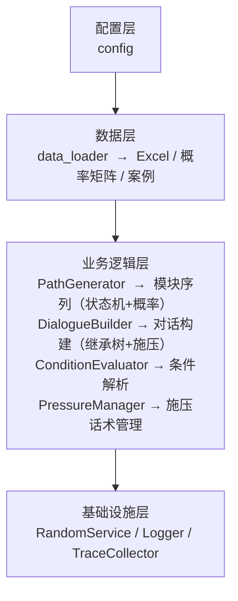

***

# 🧩一、项目背景

# python
基于规则和概率矩阵的对话数据集自动生成工具，专为电话催收场景设计。通过 Excel 话术模板 + 概率转移矩阵 + 继承树结构，自动生成大量多样化的多轮对话 JSON 数据，可直接用于 LLM 的指令微调或对话模型训练。
***

# 🧩二、功能特性

- **配置驱动**：所有业务参数（模块列表、转移规则、重复次数限制等）通过 YAML 配置文件管理，无需修改代码即可适配不同话术模板或业务逻辑。

- **模块化设计**：路径生成、对话构建、条件解析、随机服务等职责分离，便于扩展和维护。

- **继承树模拟**：每个模块内部通过 `uid` / `parent` 构建话术树，支持祖先链（完整上下文）和随机后代链（模拟分支），使对话更真实。

- **施压话术独立模块**：施压话术自身具备 repeat、继承、条件解析能力，可根据主模块出现次数动态附加，并支持合并或独立轮次。

- **断点续传 & 路径缓存**：对话生成定期保存检查点，意外中断后可恢复；路径生成结果按 `num_paths` 和 `seed` 缓存，避免重复计算。

- **可复现随机**：统一 `RandomService` 管理随机种子，确保结果可重复。

- **详细追踪**（可选）：记录每条对话的模块处理状态、跳过原因、停止原因、继承链长度、施压话术细节等，便于调试和分析。

### 2.1 架构分层图



### 2.2模块职责表

| 模块                   | 核心职责            | 关键接口                                      |
| -------------------- | --------------- | ----------------------------------------- |
| `PathGenerator`      | 生成模块序列（对话骨架）    | `generate(num_paths, seed)`               |
| `DialogueBuilder`    | 基于路径和案例生成对话消息   | `build(path, case, prompt)`               |
| `ConditionEvaluator` | 判断话术是否适用当前案例    | `evaluate(cond_str, case) -> bool`        |
| `PressureManager`    | 抽取施压话术片段（支持继承树） | `get_pressure_segment(repeat, case, ...)` |
| `RandomService`      | 统一随机服务，确保可复现    | `choice()`, `random()`, `np_choice()`     |
| `TraceCollector`     | 记录对话生成过程中的决策    | `start_dialogue()`, `set_module_status()` |

### 2.3关键流程时序图

```
main.py
  ├─ load_config()
  ├─ load_sheets() / load_prob_matrix() / load_cases()
  ├─ create_condition_evaluator()
  ├─ PathGenerator.generate() → 返回路径列表
  └─ for each path:
       └─ DialogueBuilder.build()
            ├─ 遍历 path 中模块
            ├─ 筛选 repeat + 条件 → 选中一行
            ├─ get_ancestors() + get_random_descendant_chain()
            ├─ 构建 turn_list，检查再见（概率终止）
            ├─ 追加施压话术（若有）
            └─ fill_placeholders()
```

***

# 🧩三、项目代码说明

## 3.1 核心模块说明

### 3.1.1 `dialogue_builder.py`

### 3.1.2 `path_generator.py`

### 3.1.3 `pressure_manager.py`

施压关键修改说明    ==动态概率 + 次数上限 + 延迟启动==
原因：早期模块数量多，随机触发概率固定，导致总次数在早期就达到上限，后期即使概率高也无法触发。

1. **动态施压概率**：基于模块索引 `idx` 和总模块数 `total_modules` 计算归一化位置 `t`，然后使用指数函数 `t ** exponent` 使概率后期增长更快。

2. **全局次数上限**：`self.pressure_max_total` 限制每条对话最多施压次数（默认3），超过后不再触发。

3. **模块权重**：通过 `module_pressure_weights` 配置不同模块的权重（例如“身份确认”权重为0，困难模块权重>1）。

4. **重置计数**：在每次 `build` 开始时重置 `self.pressure_count = 0`。

5. **保留兼容性**：如果 `pressure_dynamic_enabled` 为 `false`，则回退到固定概率 `pressure_prob`。

以下是一个适合放在 README 中关于施压话术触发策略的章节示例，你可以直接复制到文档的“配置说明”或“核心机制”部分。

---

## 施压话术触发策略

为了模拟真实催收中“后期逐步加压”的行为，系统采用**动态概率 + 全局次数上限 + 模块权重**的触发机制。

### 核心规则

1. **只有指定模块才可能触发**  
   由配置文件中的 `insert_nodes` 列表定义，例如 `["没钱", "失业", "破产", ...]`。

2. **触发概率随对话进度递增**  
   - 归一化位置 `t = 当前模块索引 / (路径总模块数 - 1)`（取值范围 0 ~ 1）。  
   - 动态概率公式：  
     `prob = start_prob + (end_prob - start_prob) * (t ** exponent)`  
     - `start_prob`：路径开头的基础概率（默认 0.02）  
     - `end_prob`：路径末尾的最大概率（默认 0.6）  
     - `exponent`：指数曲线（>1 使后期增长更快，默认 2.5）  
   - 概率不会超过 1.0。

3. **模块权重调整**  
   可为不同模块设置权重因子（`module_pressure_weights`），最终概率为 `prob * weight`。权重默认 1.0，困难模块可设 >1，非施压模块权重无效（因为不在 `insert_nodes` 中）。

4. **每条对话最多施压次数**  
   由 `pressure_max_total` 控制（默认 3）。达到上限后不再触发，避免施压过密。

5. **兼容固定概率模式**  
   设置 `pressure_dynamic_enabled: false` 后，将回退到固定概率 `pressure_prob`（默认 0.6），同时仍受 `pressure_max_total` 限制。

### 配置示例

```yaml
# 需要施压的模块
insert_nodes:
  - "没钱"
  - "失业"
  - "破产"
  - "生病住院"
  - "未发工资"
  - "工程款"
  - "通用原因"

# 动态概率参数（推荐）
pressure_dynamic_enabled: true
pressure_start_prob: 0.02
pressure_end_prob: 0.6
pressure_curve_exponent: 2.5
pressure_max_total: 3

# 模块权重（可选，仅对 insert_nodes 内模块生效）
module_pressure_weights:
  没钱: 1.2
  失业: 1.0
  破产: 1.0
  通用原因: 0.9

# 固定概率模式（当 dynamic_enabled = false 时使用）
pressure_prob: 0.6
```

### 效果验证

- 动态概率使施压话术集中在对话中后段，避免开头连续施压。
- 全局次数上限确保每条对话施压次数合理（通常 2~3 次）。
- 可通过 trace 分析脚本（`analyze_traces.py`）生成施压位置直方图，调整参数直至分布符合预期。

---

### 3.1.4 `utterance.py`

### 3.1.5 `condition.py`

### 3.1.6 `factory.py`

## trace 标签说明

| trace 标签                | 说明                                                                                                                                                                                                                                                     |
| ----------------------- | ------------------------------------------------------------------------------------------------------------------------------------------------------------------------------------------------------------------------------------------------------ |
| module                  | 当前处理的模块名称                                                                                                                                                                                                                                              |
| repeat                  | 该模块在当前路径上出现的次数                                                                                                                                                                                                                                         |
| status                  | 模块处理的状态，可能的值：  <br>- `"processed"`：成功处理，生成了对话轮次。  <br>- `"skipped_no_data"`：该模块在 `df_dict` 中无对应DataFrame 或为空。  <br>- `"skipped_no_repeat_match"`：没有找到匹配当前 `repeat` 次数的行。  <br>- `"skipped_condition_mismatch"`：候选行均不满足案例条件（`conditions` 列评估为 `False`）。 |
| turn_count              | 该模块贡献的对话轮次数。包括祖先链、当前行、后代链中所有成功添加的 `(user, assistant)` 对的数量。                                                                                                                                                                                            |
| ancestor_count          | 祖先链中的话术行数量。这些行构成从根节点到当前选中行的完整对话历史。                                                                                                                                                                                                                     |
| descendant_count        | 后代链中的话术行数量。随机从当前行的子节点中选择的一条分支上的节点数。                                                                                                                                                                                                                    |
| stop_reason             | 如果该模块导致整个对话终止，记录终止原因；否则为 `null`。原因示例：  <br>- `"goodbye_in_ancestor_{uid}"`：祖先链中某个话术行触发了再见。  <br>- `"goodbye_in_current_{uid}"`：当前选中的行触发了再见。  <br>- `"goodbye_in_descendant_{uid}"`：后代链中某个话术行触发了再见。                                                     |
| error                   | 保留字段，用于记录模块处理过程中捕获的异常信息（当前版本未使用）。                                                                                                                                                                                                                      |
| selected_uid            | 从满足 `repeat` 和条件筛选的 `valid_rows` 中随机选中的话术行的 `uid`。                                                                                                                                                                                                     |
| pressure_applied        | 是否在该模块处理完后附加了施压话术（依赖于模块是否在 `insert_nodes` 中且随机概率命中）。                                                                                                                                                                                                   |
| pressure_segment_length | 施压话术片段包含的原始轮次数（片段中每个元素代表一轮对话，包含 `user` 和 `assistant`）。\|                                                                                                                                                                                               |
| pressure_merge_last     | 是否将该片段的第一个助理话术合并到了上一条已有的助理消息中                                                                                                                                                                                                                          |
| goodbye_triggered       | 是否触发再见                                                                                                                                                                                                                                                 |
| goodbye_ignored         | 是否忽略再见                                                                                                                                                                                                                                                 |

## 配置文件说明

配置文件 `configs/general.yaml` 包含所有业务参数，主要字段如下：

| 字段                         | 类型    | 说明                                                                                           |
| -------------------------- | ----- | -------------------------------------------------------------------------------------------- |
| `modules`                  | list  | 模块名称列表，必须与 Excel 中 sheet 名称一致                                                                |
|                            |       |                                                                                              |
| `start_module`             | str   | 路径起始模块，默认为 `modules` 第一个                                                                     |
| `max_repeat`               | dict  | 每个模块在路径中最多出现的次数                                                                              |
| `terminal_modules`         | list  | 终止模块（如 `["承诺还款", "已还款"]`）                                                                    |
| `a_set` / `b_set`          | list  | A 集（自循环模块）和 B 集（循环模块）                                                                        |
| `insert_nodes`             | list  | 需要附加施压话术的模块                                                                                  |
| `pressure_prob`            | float | 施压话术触发概率（0~1）                                                                                |
| `goodbye_termination_prob` | float | 遇到“是否再见=1”时终止对话的概率                                                                           |
| `paths_cache`              | str   | 路径缓存模板，需包含 `{num_paths}` 和 `{seed}` 占位符，如 `"intermediate/all_paths_{num_paths}_{seed}.json"` |
| `trace_enabled`            | bool  | 是否启用详细追踪（记录每条对话的决策过程）                                                                        |
| `trace_output_dir`         | str   | 追踪数据输出目录，如 `"traces"`                                                                        |
| `logging`                  | dict  | 日志配置（级别、目录、格式等）                                                                              |
完整示例参见仓库中的 `configs/general.yaml`。

***

# 🧩四、安装与依赖

## 环境要求

- Python 3.9+

- 建议使用虚拟环境（conda 或 venv）

## 安装依赖

`重建环境：`
`conda env create -f path/to/dialogue_builder.yml`
`指定新环境名：`
`conda env create -n 新环境名 -f path/to/dialogue_builder.yml`

后续处理可以查看项目：[[data_cleaning_and_augmentation_pipeline]]

# 📄问题待解决

1. trace 记录里面的merge_last报错  -->  bool值传入出错，==实际==是and~~语句~~的问题
2. 文件时间戳一致性--> 问题不大，只是log的时间有一点点差异，可以不管
3. 可选不继承--> 已经解决
 1. 只判断current row 是否需要继承，后继还需要判断吗？
 2. 先判断是否继承，再添加对话  VS 是否再见：先添加对话再判断
